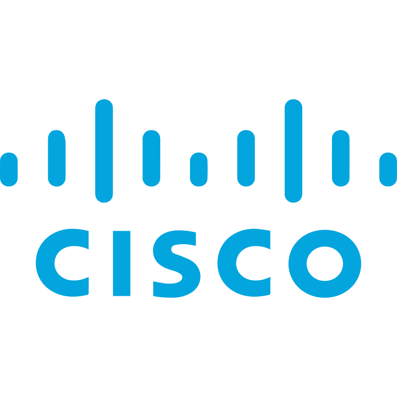
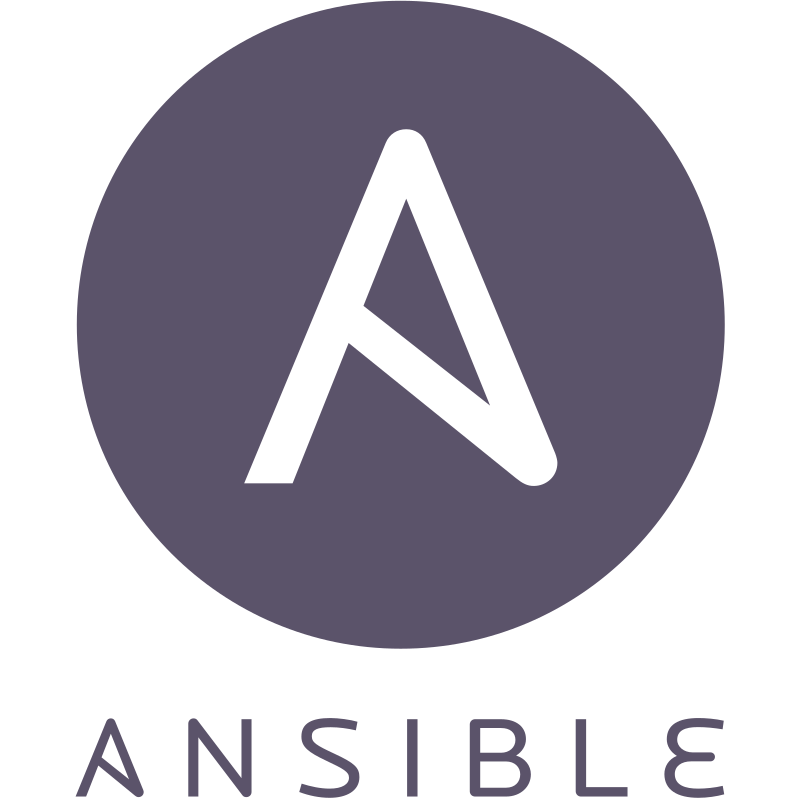
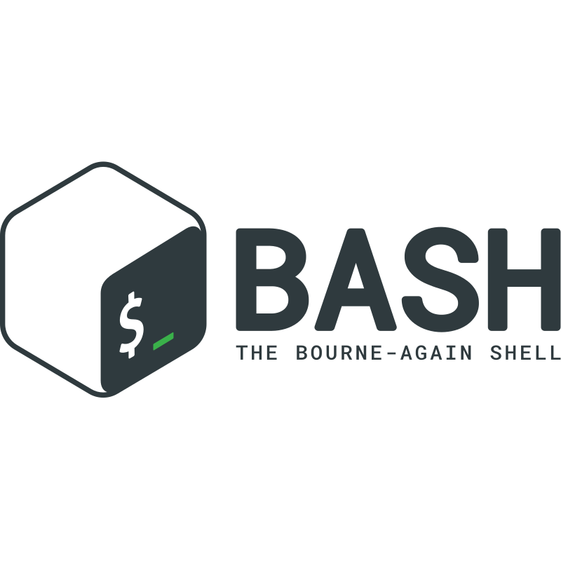
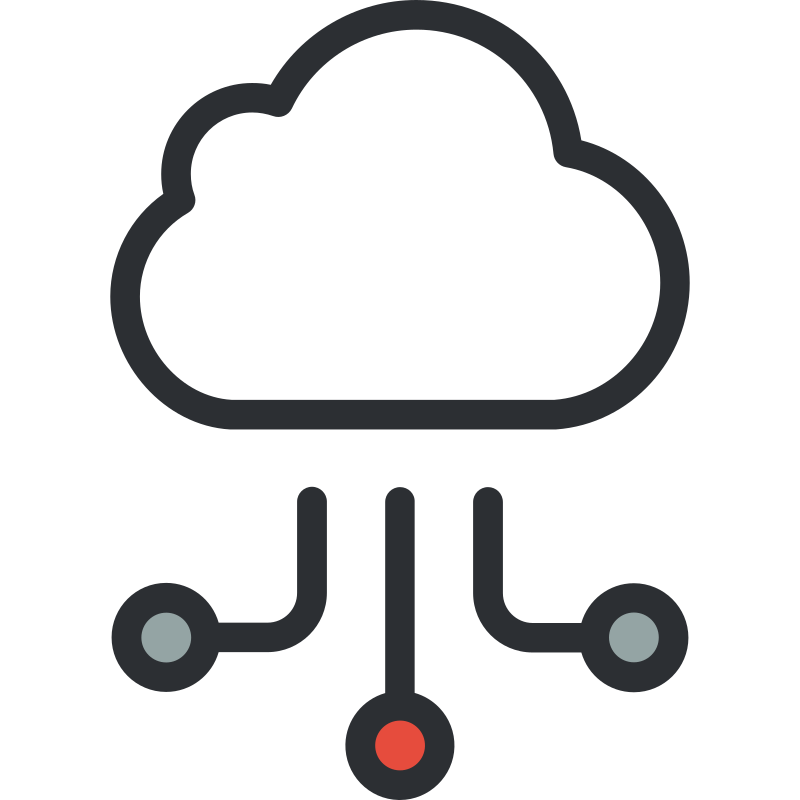

# 🎨 Public Assets CDN

**Free-to-use icons, logos, and brand assets served via GitHub Pages.**

---

## 📐 Naming Convention

| Type | Suffix | Example | Description |
|------|--------|---------|-------------|
| **Logo** | `*-logo` | `aws-logo.svg` | Brand or company identity mark. Represents the whole entity. |
| **Icon** | `*-icon` | `ec2-icon.svg` | Service or product icon. Represents a specific feature/service within a brand. |
| **Background** | `*-bg` | `gh-bg.png` | Reusable background texture or pattern. |

**Variant naming:** Use descriptive prefixes for color/style variants:
- `cisco-blue-logo.svg` — blue variant
- `ansible-color-logo.svg` — full color variant
- `samjam-orange-logo.svg` — orange brand variant (planned)
- `samjam-green-logo.svg` — green brand variant (planned)

---

## 📂 Structure

```
assets-public/
├── logos/           Brand & company logos (*-logo)
├── icons/
│   ├── aws/         AWS service icons (*-icon)
│   └── wellness/    SA Wellness Platform icons (*-icon)
├── backgrounds/     Reusable backgrounds (*-bg)
├── brand/           Personal brand (profile photo, headshots, dashboard brands)
├── graphics/        Illustrations, dividers, decorative UI elements
└── README.md
```

### Key differences:
- **logos/** = The company/tool *itself* (AWS, Cisco, Linux, Python)
- **icons/** = A *product or service within* a company or app (EC2, Lambda, dashboard-icon)
- **backgrounds/** = Textures/patterns usable across any project
- **brand/** = Personal/project identity assets (headshots, dashboard brands)
- **graphics/** = Decorative illustrations, dividers, activity art (not icons or logos)

### Metadata
Each folder contains a `metadata.md` file describing every asset: filename, description, source, and project context.

---

## 🌐 Base URL

```
https://samuelsjames.github.io/assets-public/
```

---

## 📦 Usage

```html


```

```css
background-image: url('https://samuelsjames.github.io/assets-public/backgrounds/gh-bg.png');
```

---

## 🗂️ Asset Catalog

### Logos (`logos/`)

| Preview | File | Brand | Colors | Notes |
|---------|------|-------|--------|-------|
|  | `aws-logo.svg` | Amazon Web Services | `#232F3E` (dark), `#FF9900` (orange) | Full AWS wordmark |
|  | `cisco-blue-logo.svg` | Cisco | `#049FD9` (blue) | Blue bridge mark |
|  | `ansible-color-logo.svg` | Ansible (Red Hat) | `#1A1918` (black), `#EE0000` (red) | Full color "A" mark |
|  | `linux-logo.svg` | Linux (Tux) | `#000000`, `#FCC624` (yellow) | Tux penguin mascot |
|  | `bash-logo.svg` | GNU Bash | `#4EAA25` (green), `#293036` (dark) | Shell logo |
|  | `python-logo.svg` | Python | `#3776AB` (blue), `#FFD43B` (yellow) | Dual-snake mark |
|  | `cloud-networking-logo.svg` | Generic | `#0A7CD1` (blue) | Cloud + network icon |
|  | `github-logo.svg` | GitHub | `#181717` (black) | Octocat mark |
|  | `gitea-logo.svg` | Gitea | `#609926` (green) | Tea cup mark |

### Icons (`icons/aws/`)

| Preview | File | Service | Colors | Notes |
|---------|------|---------|--------|-------|
|  | `ec2-icon.svg` | Elastic Compute Cloud | `#ED7100` (orange) | Compute service |
|  | `s3-icon.svg` | Simple Storage Service | `#569A31` (green) | Object storage |
|  | `cloudwatch-icon.svg` | CloudWatch | `#E7157B` (pink) | Monitoring & observability |
|  | `cloudformation-icon.svg` | CloudFormation | `#E7157B` (pink) | Infrastructure as code |
|  | `vpc-icon.svg` | Virtual Private Cloud | `#8C4FFF` (purple) | Network isolation |
|  | `lambda-icon.svg` | Lambda | `#ED7100` (orange) | Serverless compute |
|  | `route53-icon.svg` | Route 53 | `#8C4FFF` (purple) | DNS service |
|  | `iam-identity-center-icon.svg` | IAM Identity Center | `#DD344C` (red) | Access management |
|  | `kms-icon.svg` | Key Management Service | `#DD344C` (red) | Encryption keys |
|  | `budgets-icon.svg` | AWS Budgets | `#8C4FFF` (purple) | Cost management |

### Backgrounds (`backgrounds/`)

| File | Description | Colors | Use case |
|------|-------------|--------|----------|
| `gh-bg.png` | Dark navy circuit board / hexagon pattern | `#0D1117`, `#161B22` | Portfolio sites, dark themes |

### Brand (`brand/`)

| File | Description | Notes |
|------|-------------|-------|
| `profile.jpg` | Professional headshot | Personal use |

---

## 🎨 Color Reference (AWS Service Categories)

| Category | Hex | Services |
|----------|-----|----------|
| Compute | `#ED7100` | EC2, Lambda |
| Storage | `#569A31` | S3 |
| Networking | `#8C4FFF` | VPC, Route 53, Budgets |
| Security | `#DD344C` | IAM, KMS |
| Management | `#E7157B` | CloudWatch, CloudFormation |

---

## 📋 License

Free to use in personal or commercial projects. No attribution required.

Vendor logos (AWS, Cisco, etc.) are trademarks of their respective companies — use in accordance with their brand guidelines.

---

Made with 🛠️ by [Samuel James](https://samuelsjames.github.io/samjam-tech/)
